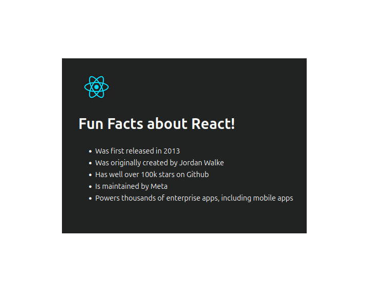

# Fun Facts About React

A simple, responsive React page that displays interesting facts about React. Built as a learning exercise following a React tutorial.


## Technologies

- **React**: JavaScript library for building user interfaces  
- **Vite**: Fast build tool and development server  
- **Tailwind CSS**: Utility-first CSS framework


## Installation

1. **Clone the repository**  
   ```bash
   git clone https://github.com/Guhirwa/ReactFacts-Project---Markup.git
   cd your-repo
   ```

2. **Install dependencies**  
   ```bash
   npm install
   # or
   yarn
   ```

3. **Start the development server**  
   ```bash
   npm run dev
   # or
   yarn dev
   ```

4. **Open in browser**  
   Visit `http://localhost:5173` (or the URL shown in the terminal).

---

## Screenshot

_Final page screenshot_




## 🌐 Live Demo

View the live demo: `your-live-demo-link`
